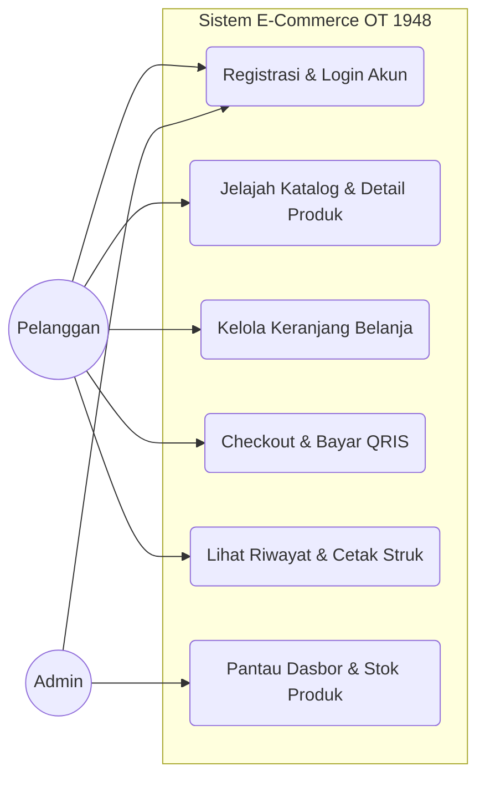
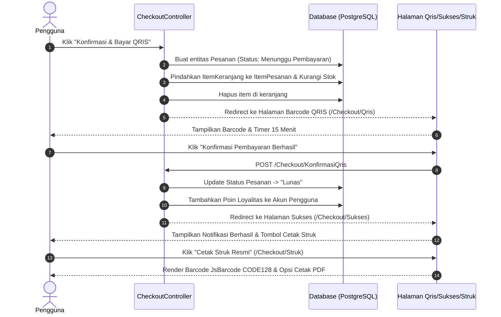
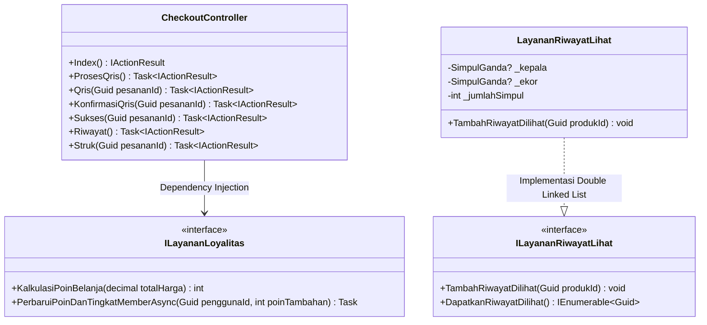
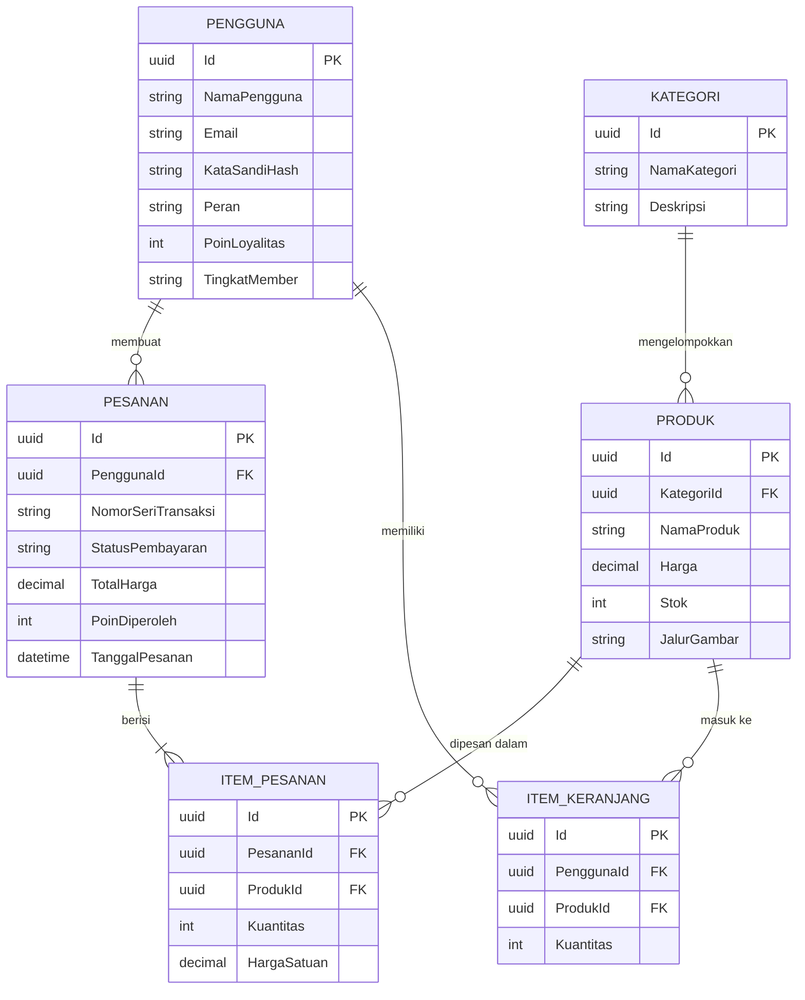

# Nama : Julio Sandra
# NIM : 2457201018
# Kelas : SI4M
# Mata Kuliah : Pemrograman Beroriestasi Object
# Member project : budisandif@gmail.com budisandif@gmail.com


# Sistem Informasi E-Commerce Produk OT (Orang Tua) 1948

Proyek aplikasi berbasis web **ASP.NET Core 8 MVC** dengan basis data **PostgreSQL** yang dikembangkan sebagai proyek akhir / Ujian Akhir Semester (UAS). Sistem ini menerapkan pola arsitektur MVC (*Model-View-Controller*), pengelolaan logika keranjang belanja dan riwayat kunjungan menggunakan struktur data kustom (*Double Linked List*), serta alur transaksi pembayaran mandiri dari tahap pemesanan hingga pencetakan struk bukti transaksi. Seluruh kode ditulis dalam standar *Clean Code* tanpa komentar sintaks.

---

## Software Requirements Specification (SRS) Ringkas

### 1. Kebutuhan Fungsional (*Functional Requirements*)
- **F-01 Registrasi & Otentikasi**: Pengguna dapat melakukan pendaftaran akun (dengan validasi batas usia minimal 21 tahun), masuk ke dalam sistem, serta keluar sesi. Antarmuka masuk dan daftar dilengkapi slider dinamis 3 gambar yang berganti otomatis setiap 6.5 detik dengan efek *breathing scale* serta animasi *mouse parallax* interaktif.
- **F-02 Katalog & Pencarian Produk**: Pengguna dapat melihat daftar produk berdasarkan kategori, mencari produk melalui papan pencarian (*Command Palette*), dan melihat detail spesifikasi produk.
- **F-03 Riwayat Kunjungan Produk (*Recently Viewed*)**: Sistem mencatat 5 produk terakhir yang dilihat oleh pengguna menggunakan algoritma *Double Linked List* (bergerak ke posisi *Head* secara dinamis).
- **F-04 Manajemen Keranjang Belanja**: Pengguna dapat menambahkan item dari halaman beranda maupun halaman detail produk, mengubah jumlah barang, atau menghapusnya dari keranjang.
- **F-05 Alur Checkout & Pembayaran QRIS**:
  - Sistem membuat pesanan dengan status awal **Menunggu Pembayaran** dan mengunci stok barang.
  - Menampilkan halaman pemindaian kode QRIS menggunakan `qrcode.min.js` dengan tampilan minimalis hitam-putih beserta hitung mundur 15 menit.
  - Memperbarui status menjadi **Lunas** setelah konfirmasi pembayaran disetujui, dan menambah poin loyalitas ke akun pengguna.
- **F-06 Riwayat & Pencetakan Struk**: Pengguna dapat melihat riwayat pembelian mandiri (baik yang berstatus *Pending* maupun *Lunas*). Struk transaksi dicetak menggunakan generator *barcode* **JsBarcode (CODE128)** yang akurat dan dapat dicetak ke format PDF.
- **F-07 Dasbor Monitoring Admin**: Admin dapat memantau grafik penjualan harian, distribusi kategori produk, serta daftar produk dengan stok kritis.
- **F-08 Papan Perintah Admin (*Command Palette*)**: Pintasan tombol `Ctrl + K` (Windows/Linux) atau `Cmd + K` (macOS) untuk navigasi dan aksi cepat admin.
- **F-09 Sinkronisasi Tema Terang & Gelap (*Theme Sync*)**: Tombol berganti tema yang sinkron secara instan di seluruh halaman (beranda, otentikasi, checkout, riwayat, dan panel admin) dengan proteksi kontras warna.

### 2. Kebutuhan Non-Fungsional (*Non-Functional Requirements*)
- **NF-01 Keamanan (*Security*)**: Kata sandi disimpan menggunakan enkripsi/hashing (`PasswordHasher`), proteksi *Antiforgery CSRF Token* pada seluruh form, serta pembatasan permintaan (*Rate Limiter*) pada endpoint otentikasi.
- **NF-02 UI/UX Responsif**: Antarmuka mendukung mode gelap (*Dark Mode*) dan mode terang (*Light Mode*) yang nyaman di mata dengan transisi animasi halus menggunakan GSAP.
- **NF-03 Kompatibilitas Lintas Platform**: Aplikasi dapat dijalankan di berbagai sistem operasi (macOS, Linux, dan Windows) dengan efisiensi memori tinggi.

---

## Struktur UML Diagrams

### A. Use Case Diagram
Diagram di bawah memperlihatkan interaksi antara **Pelanggan (*Customer*)** dan **Admin** dalam aplikasi:



---

### B. Sequence Diagram: Alur Pembayaran QRIS & Struk
Diagram urutan proses dari saat pengguna menyelesaikan pesanan di keranjang hingga verifikasi struk:



---

### C. Class Diagram (Struktur Layanan & Controller)
Gambaran hubungan antara komponen *Controller*, antarmuka layanan (*Interface Services*), dan implementasi logika program:



---

## Entity Relationship Diagram (ERD)

Diagram relasi antar tabel dalam basis data PostgreSQL:



---

## Kredensial Uji Coba

Untuk keperluan demonstrasi dan pengujian sistem pada saat presentasi atau evaluasi, gunakan akun standar berikut:

| Peran | Email | Kata Sandi | Akses Utama |
| :--- | :--- | :--- | :--- |
| **Admin Dasbor** | `julioal1@otgroup.me` | `superuser01` | Memantau grafik analitik, daftar stok produk kritis, serta tabel pesanan masuk (`Ctrl + K`). |
| **Pelanggan (*Customer*)** | `customer@otgroup.me` | `customer01` | Melakukan pemesanan barang, menguji keranjang belanja, simulasi bayar QRIS, lihat riwayat, dan cetak struk PDF. |

---

## Panduan Menjalankan Sistem

Untuk panduan instalasi lengkap di laptop **macOS (Apple Silicon / Intel)** beserta cara pemasangan paket dependencies via terminal maupun link web resmi serta pemecahan masalah (*troubleshooting*), silakan baca dokumentasi khusus pada berkas berikut:
**[macos.md](macos.md)**

### Ringkasan Eksekusi Cepat:
1. Masuk ke folder proyek:
   ```bash
   cd OT
   ```
2. Pulihkan paket *library* NuGet:
   ```bash
   dotnet restore
   ```
3. Pembaruan tabel basis data (Pastikan PostgreSQL aktif):
   ```bash
   dotnet ef database update
   ```
4. Jalankan aplikasi web:
   ```bash
   dotnet run
   ```
   Aplikasi dapat langsung diakses melalui browser pada alamat **http://localhost:5000** (atau URL yang tertera pada Terminal).
